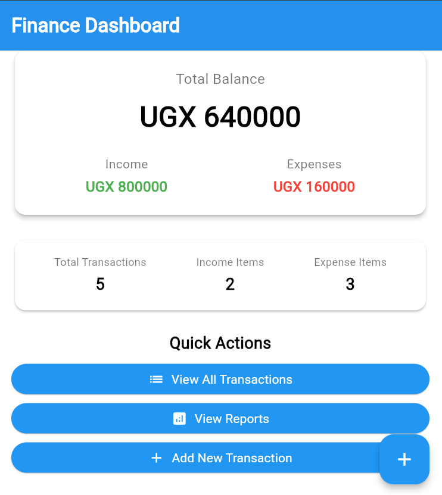
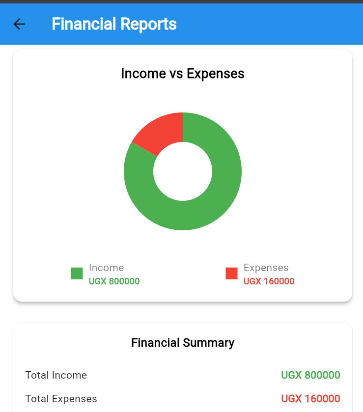
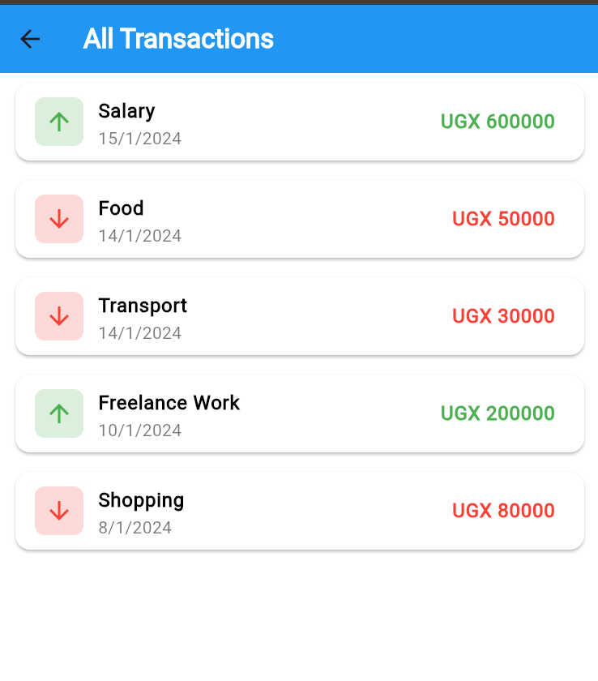

# 💰 Finance Tracker

A beautiful and intuitive Personal Finance Management app built with Flutter that helps you track your income and expenses effortlessly.

## 📸 App Preview

| Dashboard | Transactions | Reports |
|-----------|-------------|---------|
|  |  |  |

## ✨ Features

- 📊 **Dashboard Overview** - Quick glance at your financial health
- 💸 **Transaction Management** - Add, view, and manage income & expenses
- 📈 **Visual Reports** - Pie charts for income vs expenses analysis
- 🎨 **Clean UI** - Beautiful blue & white material design
- 📱 **Responsive Design** - Optimized for mobile devices

## 🛠️ Tech Stack

- **Framework**: Flutter
- **Language**: Dart
- **Architecture**: Simple Widget-based
- **State Management**: Stateless Widgets
- **Design**: Material Design 3

## 🚀 Getting Started

### Prerequisites
- Flutter SDK (3.0 or higher)
- Dart SDK
- Android Studio / VS Code

### Installation
1. Clone the repository
```bash
git clone https://github.com/katosamuelraymond/Fintrack.git